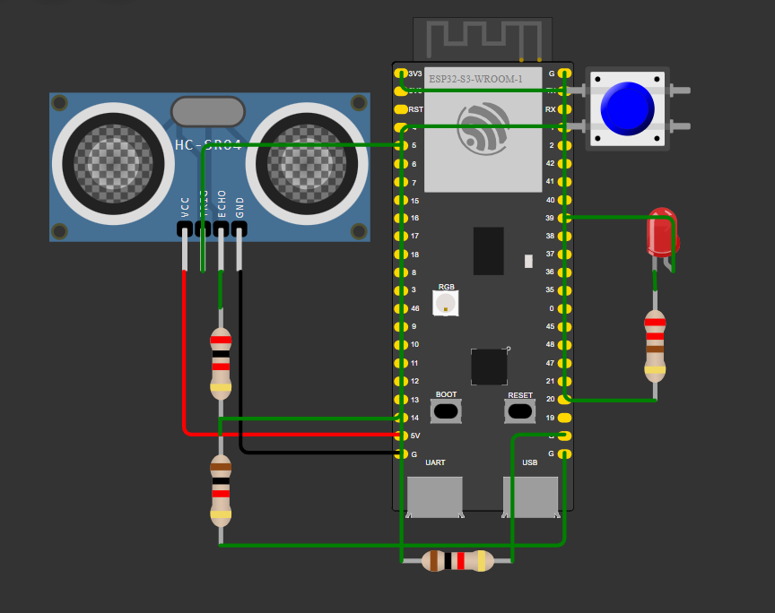

# 🌊 CyberCup – AI-Powered Urban Flood Monitoring System

CyberCup is an intelligent flood monitoring and prediction system that integrates **IoT-based sensors**, **machine learning**, and an **interactive web dashboard** to identify waterlogging risks and assist authorities with timely decision-making.

---

## 🚀 Features

* 🌧️ **IoT-Based Data Collection**
  * Rainfall intensity and drainage water levels are collected from **ESP32-based IoT devices**
  * Ultrasonic sensors and rain gauges provide real-time measurements

* 🧠 **Flood Prediction using Machine Learning**
  * LightGBM model predicts flood severity from live sensor data

* 🗺️ **Interactive Dashboard**
  * Real-time map visualization of flood-prone areas
  * Status indicators: **Safe**, **Warning**, **Danger**

* 🚦 **Automated Control Strategies**
  * Pump activation suggestions
  * Drainage diversion recommendations
  * Traffic rerouting alerts

* 🌐 **Unified Deployment**
  * Flask backend serves both APIs and frontend

---

## 🧱 Project Structure

CyberCup/
├── backend/
│ ├── app.py
│ ├── control_strategies.py
│ ├── models/
│ │ └── lgb_model.pkl
│ ├── db/
│ │ └── flash_flood.csv
│ ├── requirements.txt
│
├── CyberCUPWebpage/
│ ├── index.html
│ ├── dashboard.html
│ ├── style.css
│ ├── js/script.js
│ ├── images/
│ ├── Map/map.jpg
|── manifest.json
|── sw.js
└── README.md


---

## ⚙️ Tech Stack

* **Backend:** Flask (Python)
* **Frontend:** HTML, CSS, JavaScript
* **Machine Learning:** LightGBM
* **IoT Hardware:** ESP32, Ultrasonic Sensor, Rain Gauge
* **Deployment:** Render

---

## 🔌 IoT Data Format

timestamp,unit_id,rainfall_mm_hr,drainage_level_cm,flow_rate_lps

This data is processed by the backend for:
* Flood prediction
* Dashboard visualization
* Control strategy generation
---

## 📸 Screenshot
*iot hardware setup*



## ☁️ Deployment

The CyberCup application is fully deployed and live.

🔗 **Live Application URL:**  
👉 https://floodwatch-9d5w.onrender.com/

### Deployment Details
* Platform: **Render**
* Deployment Type: **Web Service**
* Backend: **Flask (Python)**
* Frontend: **Static HTML/CSS/JS served via Flask**

The deployed application includes:
* Live dashboard visualization
* Flood prediction using ML model
* Control strategy recommendations
* IoT-based data simulation

---

## 🔗 API Endpoints

* `GET /api/waterlogged`
* `GET /api/control_strategies/<unit_id>`

---

## ▶️ Run Locally

```bash
pip install -r requirements.txt
python backend/app.py
```
Open in browser:

http://127.0.0.1:5000/

👥 Team ZeroDay

Team Name: ZeroDay

Meet the Team

The dedicated developers behind the FLOOD WATCH project.

**Chirag Agarwal**
Team Lead

**Suryansh Manral**
Frontend Developer

**Shreyansh Jaiswal**
Data Analyst

**Pratham Ranjan**
Backend Developer

**Use Cases**

Smart city flood monitoring

Urban drainage management

Disaster preparedness systems

Infrastructure planning
